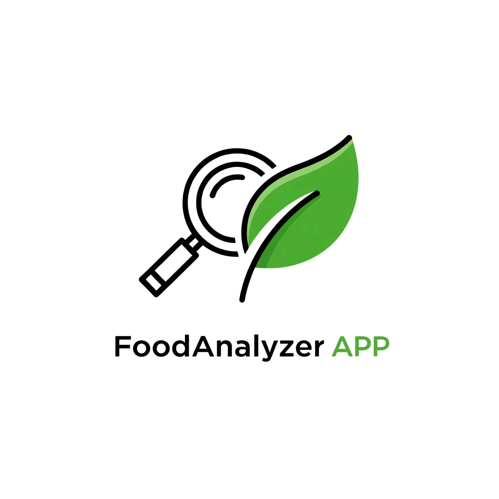

# 🍽️ FoodAnalyzer

**FoodAnalyzer** adalah aplikasi berbasis OCR yang membantu penderita autoimun mengenali **bahan makanan berbahaya** hanya dari gambar label komposisi.  
Aplikasi ini secara otomatis membaca teks dari gambar, membersihkan hasilnya, dan mencocokkannya dengan daftar *pantangan makanan* seperti gluten, susu, jagung, dan lainnya yang umum dihindari oleh penderita autoimun.



---

## 🎯 Fitur Utama

- 🔍 **OCR (Optical Character Recognition)** untuk membaca label komposisi dari gambar
- 🧪 **Pembersihan & parsing otomatis** hasil OCR menjadi list bahan
- 🚫 **Deteksi bahan pantangan** menggunakan fuzzy matching
- 📋 **Halaman daftar bahan pantangan** yang mudah dibaca
- 🌐 **Mendukung teks multi-bahasa**: Bahasa Indonesia & Inggris

---

## 🖥️ Demo Aplikasi

Akses versi online:  
🌐 [https://autoimuneats.streamlit.app](https://autoimuneats.streamlit.app)

---

## 📂 Struktur Folder

```bash
FoodAnalyzer/
├── home.py                       # Halaman utama Streamlit
├── OCR_Deteksi_Bahan.py         # Halaman OCR deteksi bahan
├── Daftar_Pantangan.py          # Halaman daftar bahan pantangan
├── analyzer.py                  # Modul analisis bahan vs pantangan
├── app/
│   └── prohibition_list.json    # File pantangan makanan
├── utils/
│   ├── image_processor.py       # Preprocessing & OCR image
│   └── text_processor.py        # Pembersihan dan pemecahan teks bahan
├── assets/
│   └── Logo.png                 # Logo aplikasi
├── requirements.txt             # Daftar dependency
└── README.md                    # Dokumentasi ini
```
---
## ⚙️ Instalasi Lokal
Pastikan Python 3.7+ dan pip sudah terpasang.

# 1. Clone repo ini
git clone https://github.com/your-username/FoodAnalyzer.git
cd FoodAnalyzer

# 2. Buat dan aktifkan virtual environment (opsional tapi disarankan)
python -m venv venv
source venv/bin/activate  # atau venv\Scripts\activate di Windows

# 3. Install dependencies
pip install -r requirements.txt

# 4. Jalankan aplikasi
streamlit run home.py

---
## 🔤 Bahasa yang Didukung
- Bahasa Indonesia (ind)
- Bahasa Inggris (eng)

Pastikan file ind.traineddata dan eng.traineddata tersedia di direktori tessdata Tesseract.

---

## 🧠 Teknologi yang Digunakan
1. Streamlit
2. Tesseract OCR
3. Pillow
4. OpenCV
5. RapidFuzz

---

## 🙋‍♀️ Kontribusi
Kontribusi sangat terbuka!
Jika kamu ingin menambahkan fitur baru, perbaikan bug, atau daftar pantangan tambahan, silakan buat PR (Pull Request) atau buka issue.

---

💡 Motivasi
Penderita autoimun sering kali kesulitan mengenali bahan-bahan yang harus dihindari, terutama saat membaca label makanan dengan teks kecil atau tidak familiar. FoodAnalyzer hadir untuk menjawab tantangan ini dengan pendekatan berbasis OCR yang mudah digunakan oleh siapa saja.

---
